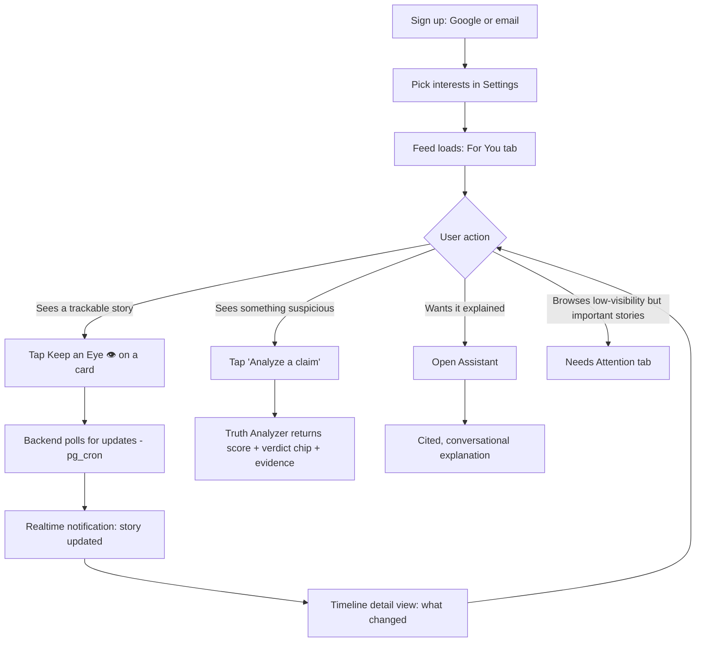
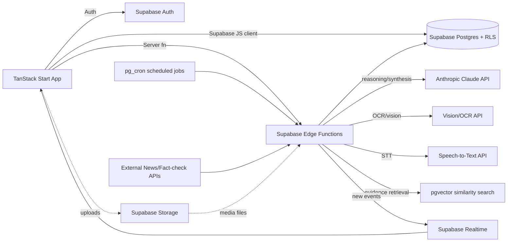
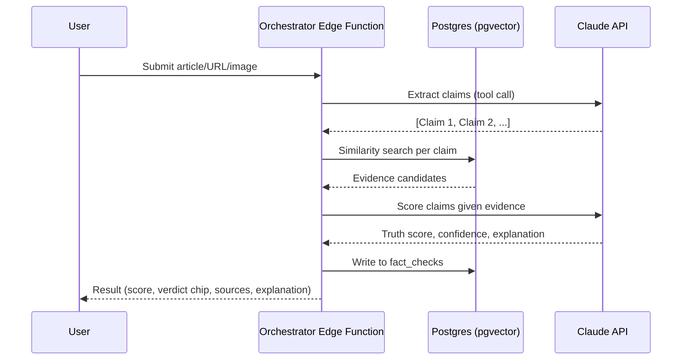

# Veritas — Complete Implementation Plan (Final)
### Truth Platform · Design + Product + Engineering

*This document supersedes the two earlier files (`verity-truth-platform-architecture.md` and `verity-architecture-v2-lovable-supabase.md`). It's the single source of truth going forward: the original vision, the revised feature scope, and the real tech stack (TanStack Start + Supabase via Lovable Cloud) all reconciled into one plan.*

---

## Table of Contents
1. Product Vision
2. Feature List
3. User Journey
4. Design System & UI Screens (matched to the actual build)
5. Frontend Architecture
6. Backend Architecture
7. AI Architecture (Multi-Agent System)
8. Database Schema
9. APIs
10. Folder Structure
11. Tech Stack
12. Development Roadmap
13. Team Roles
14. Cost Estimation
15. Future Features
16. Risks & Mitigations
17. Security
18. Scalability
19. Competitive Analysis
20. How This Improves Society

---

## 1. Product Vision

Most news apps optimize for clicks. Veritas optimizes for **truth**.

Instead of asking *"what's happening today?"*, the app answers *"what's actually true?"* — which is the exact line already sitting in your hero copy on the Feed screen. Every feature is a different lens on that same question:

| User question | Feature |
|---|---|
| "What's happening today?" | Feed |
| "Whatever happened to that promise?" | **Keep an Eye 👁** |
| "What am I not hearing about that I should be?" | Needs Attention (Feed filter) |
| "Is this viral thing true?" | Misinformation (Feed tag) |
| "Can I trust this specific article/post/video?" | Truth Analyzer |
| "Can someone explain this simply?" | Assistant |

**Non-negotiable design constraint**: the AI never issues unappealable "truth verdicts." It shows a score, a confidence level, and its sources — the "MIXED / TRUE / FALSE / UNVERIFIED" chip is a *summary label over shown evidence*, never a standalone claim of certainty. This is the core safeguard against the platform itself becoming a misinformation risk.

**Guiding principles**: evidence before opinion · confidence, not certainty · transparency by default · accountability over amnesia · importance over popularity · no dark patterns.

**North star metric**: not DAU or time-in-app — track "resolved understanding events" (tracked claims/promises that reach a clear evidence-backed update), % of tracked promises reaching resolution, and explicit per-notification usefulness ratings.

---

## 2. Feature List

| # | Feature | Where it lives (actual build) | Priority | Phase |
|---|---|---|---|---|
| 1 | Feed (Trending / Breaking / For You / Live) | `/` route, tabs | P0 | 1 |
| 2 | Needs Attention | Feed tab/filter — importance-ranked, not popularity-ranked | P0 | 4 |
| 3 | Misinformation flagging | Feed card tag + verdict chip (not a separate page) | P0 | 2–4 |
| 4 | **Keep an Eye 👁** | Dedicated nav item + timeline detail view | P0 | 3 |
| 5 | Truth Analyzer | Dedicated nav item, submit + result flow | P0 | 2 |
| 6 | Assistant (AI chat) | Dedicated nav item | P0 | 2 |
| 7 | Accountability tracking | Rendered as Feed cards (e.g. the Senator jobs-promise card) + feeds into Keep an Eye | P1 | 3–4 |
| 8 | Auth (Google + email/password) | Supabase Auth via `@lovable.dev/cloud-auth-js` | P0 | 1 |
| 9 | Personalization | "For You" tab, interests in Settings | P0 | 1 |
| 10 | Notifications | Realtime + push/email on watchlist changes | P0 | 3 |
| 11 | Dark mode | Default and only theme currently — token system already supports adding a light variant later | P0 | 1 |
| 12 | Meme Mode | Not yet in nav — recommend placing as a toggle in Settings, default off | P2 | 2 |
| 13 | Deepfake detection | Future | P2 | 5 |

---

## 3. User Journey



---

## 4. Design System & UI Screens (matched to the actual build)

### Design tokens (already defined in `styles.css` — reuse, don't reinvent)
- **Palette**: dark editorial base (`oklch(0.16 0.012 250)` background), warm amber primary (`oklch(0.86 0.15 78)`), OKLCH throughout for perceptually even color mixing.
- **Verdict colors** (semantic, already tokenized): `--verdict-true` (green), `--verdict-mixed` (amber), `--verdict-false` (red), `--verdict-unverified` (gray). Applied via the existing `.verdict-chip` class, which reads a `--verdict` custom property set per-instance — e.g. `style={{ '--verdict': 'var(--verdict-false)' }}`.
- **Typography**: `Instrument Serif` for headlines/display text (h1–h3), `Inter` for body, `JetBrains Mono` for anything numeric/code-like (could suit the Truth score number itself).
- **Radius**: 0.875rem base, scaled up/down via `--radius-sm` through `--radius-3xl` — cards in the screenshot read as `radius-xl`/`2xl`.
- **Texture**: subtle grain overlay (`.grain::after`) and dual radial-gradient background wash — already gives the "editorial, not corporate" feel visible in the screenshot. Reuse on any new full-bleed screen (Truth Analyzer result, Keep an Eye timeline) rather than introducing flat backgrounds.

### Screen-by-screen (routes match the actual nav: Feed, Truth Analyzer, Keep an Eye, Assistant, Settings)

**Feed (`/`)** — confirmed built. Hero: "TODAY" eyebrow → serif headline "What's *actually* true?" → subhead "Signal over noise, verified over viral." → "Analyze a claim" primary CTA (amber, routes to Truth Analyzer). Tab row: For you / Trending / Breaking / Needs attention / Live. Card grid, 2-column on desktop. **Card anatomy** (reusable `FeedCard` component):
```
[CATEGORY eyebrow]                    [VERDICT chip]
Headline (serif, 2 lines max)
One-line summary (muted foreground)
Truth [score]  [progress bar, fill color = verdict color]     [Keep an Eye button]
```
Note the progress bar fill color directly matches the verdict chip color in the screenshot (amber for Mixed, red for False, green for True) — keep that mapping consistent in the component, it's a nice bit of redundant encoding that helps accessibility (color + label + position all agree).

**Truth Analyzer** — submission screen: input modes (paste text/URL, upload image/PDF, paste YouTube link, voice). Result screen: same Truth meter + verdict chip pattern as Feed cards, but expanded — full explanation, supporting/contradicting evidence lists, source cards, Beginner/Expert mode toggle.

**Keep an Eye** — list view: saved items as cards (reuse `FeedCard` shape with a progress-to-completion bar instead of/alongside Truth score where relevant, e.g. the Senator jobs card). Detail view: vertical timeline, each node = dated event with a one-line AI summary of *what changed*, pinned "Since you saved this" summary box at top.

**Assistant** — standard chat layout; every factual sentence citable inline; Beginner/Expert + Meme Mode toggles live here or in Settings (open question — pick one, don't duplicate).

**Settings** — interests, notification preferences (granular per-feature), Meme Mode toggle, data/privacy controls, list of active Keep an Eye + Accountability subscriptions in one place.

---

## 5. Frontend Architecture

- **Framework**: TanStack Start (Vite + React 19), SSR-capable, file-based routing via TanStack Router under `src/routes/`.
- **Data**: TanStack Query wraps the Supabase JS client for reads; TanStack Start server functions (`createServerFn`) handle anything needing elevated privileges (e.g. invoking an Edge Function with a service-role key that must never reach the browser).
- **Auth**: `@lovable.dev/cloud-auth-js` session wraps Supabase Auth; gate routes via TanStack Router's `beforeLoad`.
- **Components**: shadcn/ui (Radix-based) primitives already scaffolded — build feature components (`FeedCard`, `VerdictChip`, `TruthMeter`, `KeepAnEyeButton`, `TimelineNode`) on top of them, using the existing design tokens rather than new styles.
- **Forms**: react-hook-form + zod (already installed) — use for the Truth Analyzer submission form and Settings.
- **Charts**: recharts (already installed) — use for Truth score trend graphs on Keep an Eye timeline views and Accountability progress charts.

---

## 6. Backend Architecture



Everything runs on **Supabase via Lovable Cloud**: managed Postgres, Auth, Storage, and serverless Edge Functions (Deno) in one project. This is the right amount of infrastructure for Phases 1–3 — a custom multi-service backend would be overhead you don't need yet. Graduate specific heavy jobs (deep video-forensics pipelines, high-volume Keep an Eye polling) to a small dedicated worker service only once Edge Function execution limits actually become a bottleneck — that's a Phase 4–5 concern.

---

## 7. AI Architecture (Multi-Agent System)

Same conceptual agents as the original design, implemented as steps/tool-calls inside Edge Functions rather than separate microservices:

| Agent | Job | Runtime |
|---|---|---|
| Claim Extractor | Pull atomic, checkable claims from submitted text/URL/transcript | Step in orchestrator Edge Function |
| Evidence Retriever | pgvector similarity search + live web/news API calls | Step in orchestrator Edge Function |
| Source Validator | Score publisher/account credibility | Lookup against `sources` table |
| Fact Checker | Weigh evidence, produce score + confidence + explanation | Claude API call within orchestrator |
| Bias Analyzer | Flag framing/language bias | Claude API call, Phase 4 |
| Image/Video Analyzer | OCR, manipulation checks, transcript | Separate Edge Function, called by orchestrator |
| Watchlist Tracker | Detect new events matching a Keep an Eye subject | Scheduled Edge Function via `pg_cron` |
| Notification dispatcher | Decide/batch what's worth notifying | Scheduled or event-triggered Edge Function |



**Truth Score composite** (shown to the user, never a black box):
```
TruthScore = f(
    evidence_corroboration,   // independent credible sources agreeing
    source_credibility_avg,   // from Source Validator
    contradiction_penalty,
    primary_source_bonus,     // official docs beat secondhand reporting
    claim_specificity,
    recency_relevance
)
```
Confidence band always shown alongside the score (e.g. "68/100, Medium confidence — 4 sources, 1 official").

---

## 8. Database Schema (Supabase/Postgres)

```sql
create table sources (
  id uuid primary key default gen_random_uuid(),
  name text not null,
  domain text unique,
  credibility_score numeric check (credibility_score between 0 and 100),
  bias_lean text,
  region text,
  verified boolean default false
);

create table articles (
  id uuid primary key default gen_random_uuid(),
  title text not null,
  body text,
  url text,
  source_id uuid references sources(id),
  category text,             -- drives the Feed eyebrow label
  published_at timestamptz,
  image_url text,
  embedding vector(1536)
);

create table claims (
  id uuid primary key default gen_random_uuid(),
  article_id uuid references articles(id),
  submitted_by uuid references auth.users(id),
  text text not null,
  created_at timestamptz default now()
);

create table evidence (
  id uuid primary key default gen_random_uuid(),
  claim_id uuid references claims(id) on delete cascade,
  source_id uuid references sources(id),
  snippet text,
  stance text check (stance in ('support','contradict','context')),
  url text,
  retrieved_at timestamptz default now()
);

create table fact_checks (
  id uuid primary key default gen_random_uuid(),
  claim_id uuid references claims(id) on delete cascade,
  truth_score numeric check (truth_score between 0 and 100),
  confidence text check (confidence in ('low','medium','high')),
  verdict text check (verdict in ('true','mixed','false','unverified')), -- drives VerdictChip color
  explanation text,
  methodology_version text,
  created_at timestamptz default now()
);

create table watchlists (   -- Keep an Eye
  id uuid primary key default gen_random_uuid(),
  user_id uuid references auth.users(id) not null,
  subject_type text check (subject_type in ('person','promise','event','topic')),
  subject_ref text not null,
  status text default 'active',
  created_at timestamptz default now()
);

create table timeline_events (
  id uuid primary key default gen_random_uuid(),
  watchlist_id uuid references watchlists(id) on delete cascade,
  event_date timestamptz not null,
  summary text not null,
  source_url text,
  change_type text check (change_type in ('progress','delay','cancel','new_info'))
);

create table promises (   -- Accountability
  id uuid primary key default gen_random_uuid(),
  entity_name text not null,
  entity_type text check (entity_type in ('politician','company','ngo','govt')),
  statement text not null,
  made_on date,
  category text,
  status text default 'pending',
  completion_pct numeric check (completion_pct between 0 and 100)
);

create table promise_updates (
  id uuid primary key default gen_random_uuid(),
  promise_id uuid references promises(id) on delete cascade,
  update_text text not null,
  evidence_url text,
  new_status text,
  updated_at timestamptz default now()
);

create table notifications (
  id uuid primary key default gen_random_uuid(),
  user_id uuid references auth.users(id) not null,
  type text not null,
  payload jsonb,
  read boolean default false,
  created_at timestamptz default now()
);

create table bookmarks (
  id uuid primary key default gen_random_uuid(),
  user_id uuid references auth.users(id) not null,
  article_id uuid references articles(id),
  created_at timestamptz default now()
);
```

**RLS pattern** (apply to `watchlists`, `bookmarks`, `notifications`):
```sql
alter table watchlists enable row level security;

create policy "Users manage their own watchlists"
  on watchlists for all
  using (auth.uid() = user_id)
  with check (auth.uid() = user_id);
```
`articles`, `claims`, `evidence`, `fact_checks`, `promises`, `promise_updates`, `sources` are public-read; writes restricted to service-role (Edge Functions only).

---

## 9. APIs

No custom REST layer needed for most reads/writes — the Supabase client handles those directly against RLS-protected tables. What you do need as explicit **Edge Function endpoints**:

| Endpoint (Edge Function) | Purpose |
|---|---|
| `POST /functions/v1/analyze` | Truth Analyzer submission → runs the orchestrator pipeline, writes `claims`/`evidence`/`fact_checks` |
| `POST /functions/v1/chat` | Assistant streaming responses |
| `POST /functions/v1/watchlist-poll` | Scheduled via `pg_cron`; checks for new content matching active watchlists |
| `POST /functions/v1/notify` | Dispatches push/email from queued notification events |

Everything else (Feed queries, bookmarks, Keep an Eye list, Settings) is direct Supabase client reads/writes against the schema in §8, filtered by RLS.

---

## 10. Folder Structure

```
verity/
├── src/
│   ├── routes/
│   │   ├── index.tsx                 # Feed
│   │   ├── truth-analyzer.tsx
│   │   ├── keep-an-eye/
│   │   │   ├── index.tsx
│   │   │   └── $watchlistId.tsx
│   │   ├── assistant.tsx
│   │   └── settings.tsx
│   ├── components/
│   │   ├── ui/                       # shadcn primitives
│   │   └── feed/
│   │       ├── FeedCard.tsx
│   │       ├── VerdictChip.tsx
│   │       ├── TruthMeter.tsx
│   │       └── KeepAnEyeButton.tsx
│   ├── lib/
│   │   ├── supabase.ts
│   │   └── queries/
│   ├── server/functions/
│   └── styles.css
├── supabase/
│   ├── migrations/
│   └── functions/
│       ├── analyze/
│       ├── chat/
│       ├── watchlist-poll/
│       └── notify/
└── package.json
```

---

## 11. Tech Stack

| Layer | Technology |
|---|---|
| Frontend framework | TanStack Start (Vite + React 19) |
| UI components | shadcn/ui on Radix |
| Styling | Tailwind v4, CSS-first config, OKLCH tokens |
| Data fetching | TanStack Query + Supabase JS client |
| Forms | react-hook-form + zod |
| Charts | recharts |
| Backend | Supabase (Postgres, Auth, Storage, Edge Functions) via Lovable Cloud |
| Vector search | pgvector |
| Scheduled jobs | `pg_cron` + Edge Functions |
| Realtime | Supabase Realtime |
| AI reasoning | Anthropic Claude API |
| OCR | Google Cloud Vision API |
| Speech-to-text | Hosted Whisper API |
| Auth | Supabase Auth + `@lovable.dev/cloud-auth-js` |
| Search (later) | Postgres full-text search → Meilisearch if needed |

---

## 12. Development Roadmap

| Phase | Status | Remaining work |
|---|---|---|
| **1 — Foundation** | Design system, nav shell, Feed UI, auth wiring already in place | Migrate schema (§8), replace placeholder Feed cards with real data, wire Keep an Eye button to real inserts |
| **2 — Core AI** | Truth Analyzer/Assistant page shells exist | Build `analyze` and `chat` Edge Functions, OCR pipeline, Meme Mode toggle |
| **3 — Memory & Alerts** | Keep an Eye nav + timeline concept visible | `watchlist-poll` + `notify` Edge Functions, `pg_cron` schedule, Realtime wiring |
| **4 — Depth** | Feed already shows Needs Attention/Misinformation as tags | Formalize importance-ranking query, Bias Analyzer, decide on dedicated Misinformation/Accountability pages (§4 open question) |
| **5 — Scale & Advanced AI** | — | Split heavy agents into dedicated services, deepfake detection, multi-language, migrate off pgvector only if corpus size demands it |

---

## 13. Team Roles

| Role | Count | Notes |
|---|---|---|
| Product Manager | 1 | |
| UX/UI Designer | 1 | Extend the existing design system, not replace it |
| Full-stack Engineers | 2–3 | TanStack Start + Supabase — fewer dedicated "backend" hires needed than a custom-microservices plan |
| AI/ML Engineer | 1–2 | Edge Function orchestration, prompt/tool design |
| Mobile Engineer | 1 | If/when a native app is prioritized |
| QA Engineer | 1 | |
| Human Fact-Check Editors | 2–3 | Review high-stakes AI fact-checks before they ship |
| Security/Legal Advisor | 1 (part-time/advisory) | RLS policy review, defamation risk |

---

## 14. Cost Estimation

| Users | Supabase tier | Rough monthly infra |
|---|---|---|
| 100 | Free/Pro | $25–50 |
| 10,000 | Pro + add-ons | $100–300 |
| 100,000 | Team tier | $600–2,000 |
| 1,000,000 | Enterprise / self-hosted migration | $5,000–20,000+ |

**Dominant cost driver at every scale is LLM/external API spend**, not Supabase itself — cache fact-check results aggressively so the same claim isn't re-analyzed from scratch.

---

## 15. Future Features
Deepfake detection maturity · browser extension for real-time claim-checking · community evidence layer (moderated, AI-triaged) · publisher verification program · regional language expansion · Election Mode · researcher/journalist API access to the Claim Graph · quarterly transparency reports.

---

## 16. Risks & Mitigations

| Risk | Mitigation |
|---|---|
| AI hallucination in fact-checks | Human review for high-stakes claims, always show sources + confidence, never binary verdicts |
| Perceived political bias | Published, versioned scoring methodology, external audits, balanced source panel |
| Legal/defamation exposure | Legal review workflow, "disputed/unverified" language over accusatory labels, right-of-reply |
| External API cost/rate limits | Aggressive caching, fallback providers |
| Data privacy | Encryption, minimization, GDPR/DPDP-style compliance |
| Prompt injection via submitted content | Strict separation of "content to analyze" vs. "instructions" in every Edge Function |
| Coordinated gaming of rankings | Anomaly detection, human editorial override |

---

## 17. Security
- RLS policies (§8) replace most custom authorization code.
- Rate limiting on `analyze`/`chat` Edge Functions (per-user quotas) to control abuse and LLM cost.
- Prompt injection defense: submitted content is always data, never instructions, in every Claude call.
- Storage: signed URLs for uploaded media, never public buckets for user-submitted content.
- Service-role keys live only in Edge Functions/server functions — never shipped to the client bundle.

---

## 18. Scalability
Supabase's own scaling path covers Phases 1–4: connection pooling (pgbouncer), read replicas at higher tiers, Edge Function autoscaling. Revisit self-hosting Postgres and splitting out dedicated services only once you're firmly in seven-figure-user territory (§14) — don't build for that scale prematurely.

---

## 19. Competitive Analysis

| Dimension | Veritas | Google News | Inshorts | Ground News | Community Notes | Perplexity |
|---|---|---|---|---|---|---|
| Fact-checking depth | Deep, evidence-graded | None | None | Bias only | Crowd, reactive | Shallow |
| Promise/accountability tracking | **Yes — unique** | No | No | No | No | No |
| Continuous story tracking | **Yes — unique** | No | No | No | No | No |
| Underreported news surfacing | **Yes — dedicated** | No | No | No | No | No |
| AI assistant, citation-grounded | Yes | No | No | No | No | Yes |

Veritas's edge isn't any single feature — it's continuous tracking + accountability + evidence-graded verification in one product, which nothing else combines.

---

## 20. How This Improves Society

The **Keep an Eye / Accountability** loop is the highest-leverage feature: making promises impossible to quietly forget changes incentives for public figures. **Needs Attention** actively counters algorithmic popularity bias. Both only work if the ranking methodology behind them is published and externally auditable — otherwise Veritas just becomes a different, less accountable algorithm making the same kind of invisible editorial choices it's trying to replace. Meme Mode should ride on top of accurate content, never soften a hedge for the sake of being fun. The product succeeds if it makes truth cheaper to find and power harder to walk back on — not if it maximizes time-in-app.
