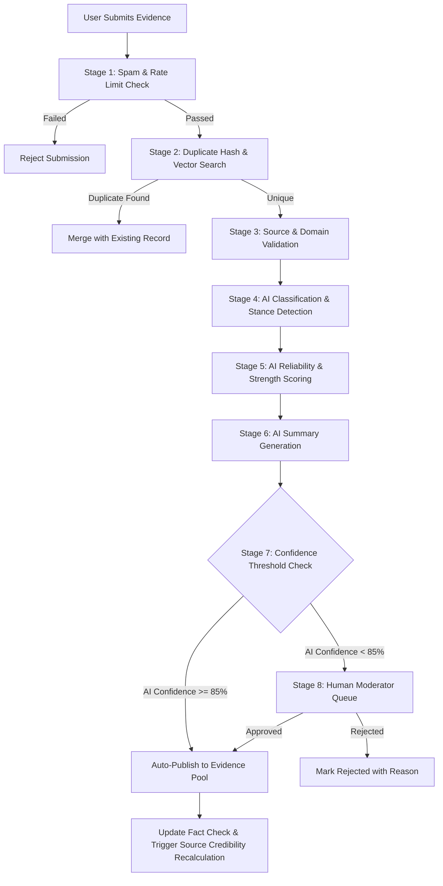
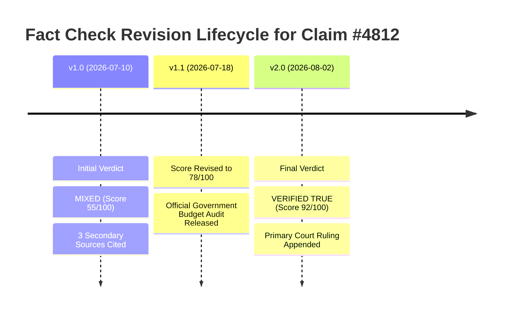
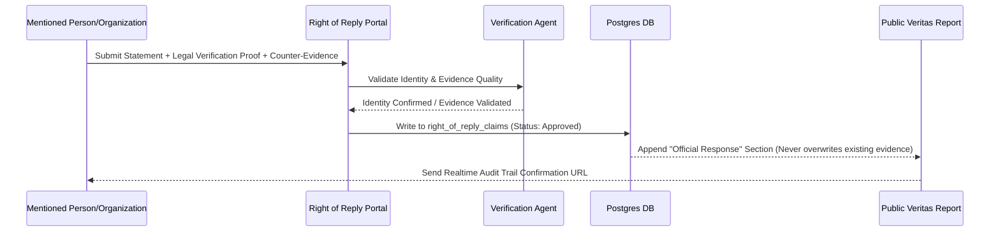
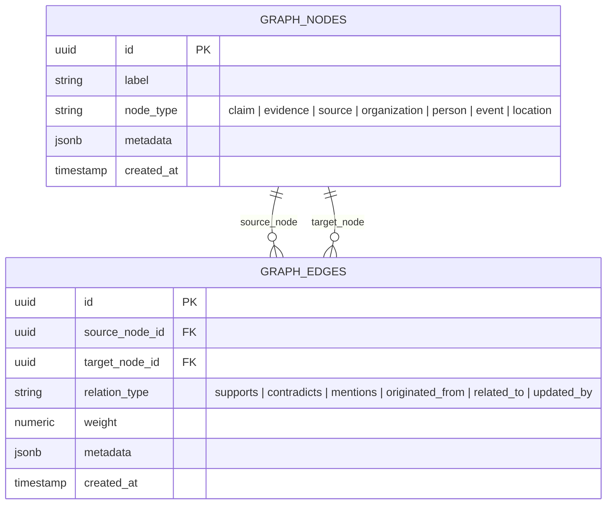
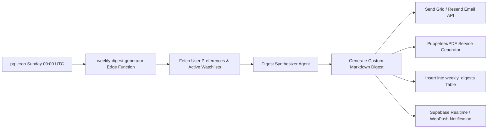
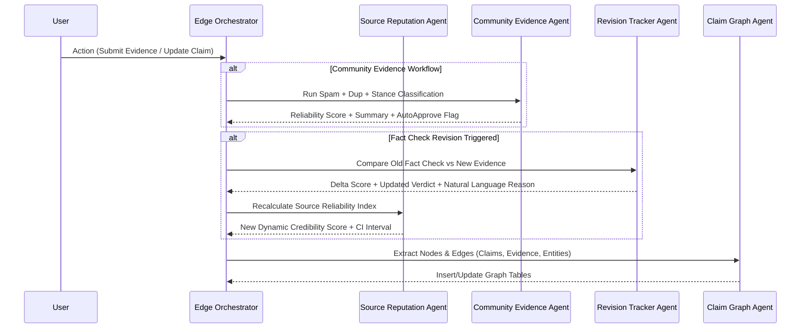
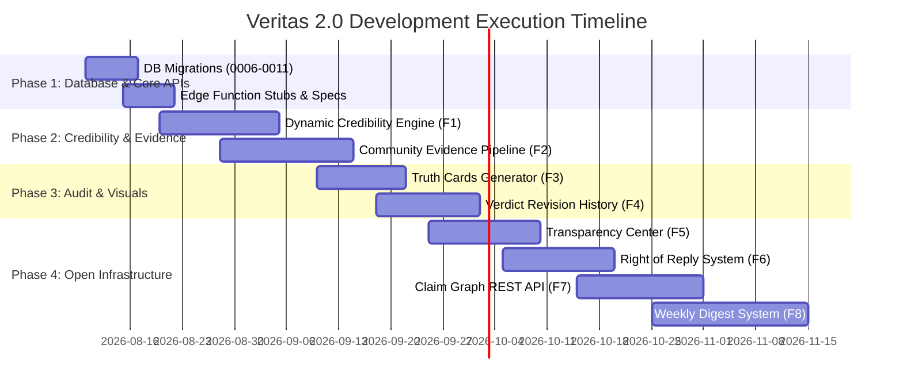

# VERITAS 2.0 — MASTER SYSTEM EVOLUTION BLUEPRINT
## Architecture, Database Schema, AI Pipeline & Feature Implementation Specifications

> **Core Philosophy**: "Evidence over Opinions."
> **Mission**: Transform Veritas into an unassailable enterprise-grade truth infrastructure through dynamic source credibility, community-driven evidence verification, immutable verdict revision tracking, open claim graphs, entity right-of-reply protocols, and complete transparency.

---

## 1. EXECUTIVE SUMMARY & EVOLUTION OVERVIEW

Veritas 2.0 extends the core platform without altering its foundation or breaking existing functionality. Every newly added component adheres to the established design system (Dark Editorial, `oklch` color spaces, `Instrument Serif` / `Inter` / `JetBrains Mono` typography) and tech stack (**Vite + React 19 SPA**, **TanStack Router**, **TanStack Query**, **Supabase Postgres + RLS**, and **Supabase Edge Functions**).

### Key Architectural Extensions

```
┌──────────────────────────────────────────────────────────────────────────────────┐
│                             VERITAS 2.0 ARCHITECTURE                             │
├──────────────────────────────────────────────────────────────────────────────────┤
│ 1. Dynamic Credibility Engine  : Time-decayed Bayesian source reputation score   │
│ 2. Community Evidence Layer   : 8-stage AI moderation pipeline for evidence      │
│ 3. Shareable Truth Cards      : 5 visual templates with QR deep links & OG render │
│ 4. Verdict Revision History   : Immutable append-only audit log & visual timeline │
│ 5. Transparency Center        : Open methodology, algorithm explorer & limits    │
│ 6. Right of Reply System      : Entity response workflow & append-only audit     │
│ 7. Claim Graph API            : Public REST graph endpoint for researchers       │
│ 8. Weekly Intelligence Digest : Multi-channel automated weekly synthesis          │
└──────────────────────────────────────────────────────────────────────────────────┘
```

---

## 2. UPDATED SYSTEM ARCHITECTURAL DIAGRAM

```mermaid
flowchart TD
    subgraph Client Layer [Vite + React 19 SPA]
        Feed[Home Feed & Cards]
        Analyzer[Truth Analyzer UI]
        KeepEye[Keep an Eye Timeline]
        Transparency[Transparency Center /transparency]
        SourceDash[Source Credibility Dashboard]
        EvidencePanel[Community Evidence Panel]
        GraphView[Claim Graph Explorer]
        CardGen[Truth Card Generator]
        ReplyModal[Right of Reply Modal]
        DigestView[Weekly Digest Screen]
    end

    subgraph API & Gateway Layer [Supabase API / Vercel Edge]
        Auth[Supabase Auth & RLS Policy Engine]
        RestAPI[Claim Graph REST API Gate]
        EdgeGate[Edge Function Router]
    end

    subgraph Edge Microservices [Supabase Edge Functions]
        EF_Analyze[analyze]
        EF_Credibility[update-credibility]
        EF_Mod[evidence-moderator]
        EF_Revision[verdict-revision]
        EF_Reply[right-of-reply]
        EF_Graph[claim-graph-builder]
        EF_Digest[weekly-digest-generator]
        EF_Card[truth-card-renderer]
    end

    subgraph Multi-Agent AI System [Anthropic Claude + Vision + Search]
        RepAgent[Source Reputation Agent]
        ModAgent[Community Evidence Agent]
        RevAgent[Revision Tracker Agent]
        ReplyAgent[Right of Reply Agent]
        GraphAgent[Claim Graph Agent]
        DigestAgent[Digest Synthesizer Agent]
    end

    subgraph Database Layer [Supabase Postgres 15 + pgvector]
        Tables_Core[articles, claims, evidence, fact_checks]
        Tables_Cred[sources, source_credibility_history, source_reviews]
        Tables_Community[community_evidence, evidence_moderation_queue]
        Tables_Audit[fact_check_revisions, right_of_reply_claims]
        Tables_Graph[graph_nodes, graph_edges]
        Tables_Digest[weekly_digests, user_digest_preferences]
    end

    Client Layer --> Auth
    Auth --> RestAPI
    Auth --> EdgeGate

    EdgeGate --> EF_Analyze
    EdgeGate --> EF_Credibility
    EdgeGate --> EF_Mod
    EdgeGate --> EF_Revision
    EdgeGate --> EF_Reply
    EdgeGate --> EF_Graph
    EdgeGate --> EF_Digest
    EdgeGate --> EF_Card

    EF_Credibility --> RepAgent
    EF_Mod --> ModAgent
    EF_Revision --> RevAgent
    EF_Reply --> ReplyAgent
    EF_Graph --> GraphAgent
    EF_Digest --> DigestAgent

    EF_Analyze --> Database Layer
    EF_Credibility --> Database Layer
    EF_Mod --> Database Layer
    EF_Revision --> Database Layer
    EF_Reply --> Database Layer
    EF_Graph --> Database Layer
    EF_Digest --> Database Layer
```

---

## 3. FEATURE-BY-FEATURE DETAILED SPECIFICATIONS

### FEATURE 1: Dynamic Source Credibility Engine

#### Philosophy & Math Model
Replaces static 0–100 scores with a dynamic Bayesian reputation system. Reputation rewards long-term consistency over popularity and applies a time-decay factor so past errors weigh less over time if rectified.

**Credibility Score Formula**:
$$S(t) = \left[ w_a \cdot A(t) + w_e \cdot E(t) + w_t \cdot T(t) - P_r \cdot R(t) - P_b \cdot B(t) \right] \times C(n)$$

Where:
- $A(t)$: Historical Accuracy Score ($0.0 - 1.0$), computed as:
  $$A(t) = \frac{\sum_{i=1}^n w_i \cdot v_i}{\sum_{i=1}^n w_i}$$
  where $v_i = 1.0$ (Verified True), $0.5$ (Partially Correct), $0.0$ (False), and decay weight $w_i = e^{-\lambda (t - t_i)}$.
- $E(t)$: Average Evidence Quality Score ($0.0 - 1.0$), derived from cited primary documents.
- $T(t)$: Transparency Rating ($0.0 - 1.0$), evaluating authorship, correction policies, and funding disclaimers.
- $R(t)$: Retraction Penalty ($0.0 - 1.0$), calculated as $\min(1.0, \text{unannounced\_retractions} \times 0.2)$.
- $B(t)$: Bias Volatility Penalty ($0.0 - 1.0$), penalizing sudden ungrounded sentiment swings.
- $C(n)$: Sample Size Confidence Factor: $C(n) = \frac{n}{n + 10}$, where $n$ is total fact-checked claims.
- Weights: $w_a = 50$, $w_e = 25$, $w_t = 15$, $P_r = 20$, $P_b = 10$. Final score is clamped to $[0, 100]$.

#### Confidence Interval Calculation
Will compute 95% Wilson Score Confidence Interval for source reliability:
$$\text{CI}_{95\%} = \frac{\hat{p} + \frac{z^2}{2n} \pm z \sqrt{\frac{\hat{p}(1-\hat{p})}{n} + \frac{z^2}{4n^2}}}{1 + \frac{z^2}{n}}$$
where $\hat{p} = A(t)$ and $z = 1.96$.

---

### FEATURE 2: Community Evidence Layer

#### 8-Stage Moderation Pipeline Workflow



#### Evidence Strength Matrix
- **Level 5 (Primary/Official)**: Court orders, official government databases, peer-reviewed research papers.
- **Level 4 (Direct Sensor/Archive)**: Unedited raw video/audio recordings, cryptographic Wayback machine archives.
- **Level 3 (Secondary Investigative)**: Major investigative reporting with multi-source corroboration.
- **Level 2 (Single Outlet Report)**: Single news article without direct primary attachment.
- **Level 1 (User Commentary/Blog)**: Personal posts, unverified social media claims (Requires strict corroboration).

---

### FEATURE 3: Shareable Truth Cards

#### Card Specification & Customization
Cards are exported as high-resolution PNG/SVG images rendered either client-side (via Canvas API / `html-to-image`) or server-side via Supabase Edge Function (`/functions/v1/truth-card-renderer`).

#### Included Metadata
1. Article / Claim Headline (Serif font)
2. Veritas Truth Score (0-100 gauge visual)
3. Verdict Tag (`VERIFIED TRUE`, `MIXED CONTEXT`, `FALSE / DEBUNKED`, `UNVERIFIED`)
4. Confidence Rating & Evidence Count Badge
5. 2-line AI Synthesis Summary
6. Dynamic Vector QR Code pointing to `https://veritas.app/v/<claim_id>`
7. Timestamp & Veritas Brand Watermark
8. Custom Visual Themes:
   - **Minimal**: Clean monochrome dark layout
   - **Modern**: Obsidian background with neon OKLCH accents
   - **Dark Editorial**: Signature Veritas luxury dark navy (`#0d111a`) with coral orange
   - **Professional**: High-contrast corporate reporting aesthetic
   - **Mobile Friendly**: Vertical 9:16 story/reel format optimized for Instagram/TikTok

---

### FEATURE 4: Verdict Revision History

#### Audit Trail Engine
Fact checks are **never mutated in-place**. Any re-evaluation creates a version snapshot in `fact_check_revisions`.



#### Diff Engine Tracking
- Score Delta ($\Delta S = S_{new} - S_{old}$)
- Added Evidence IDs vs Removed Evidence IDs
- Methodology version changes (e.g. `v1.0` -> `v2.0`)
- Natural language explanation of why the revision occurred generated by the Revision Tracker Agent.

---

### FEATURE 5: Transparency Center (`/transparency`)

#### Public Explanability Interface
A dedicated, fully open interactive page detailing platform mechanics:
1. **Truth Score Formula**: Interactive sliders letting users adjust evidence weight parameters to see how scores are derived.
2. **Confidence Band Logic**: Complete breakdown of low, medium, and high confidence boundaries.
3. **Needs Attention Algorithm**: Explanation of the Underreported Crisis Index ($UCI = \frac{\text{Global Impact Rating}}{\text{Mainstream Outlet Coverage Count}}$).
4. **Source Credibility Evolution**: Live math model and public logs of source tier adjustments.
5. **AI Model Transparency**: Current model versions (e.g. Claude 3.5 Sonnet), system prompts, fallback providers, and temperature settings.
6. **Known Limitations**: Explicit disclaimers regarding emerging breaking news, lack of immediate translation for rare regional dialects, and data blind spots.

---

### FEATURE 6: Right of Reply System

#### Entity Dispute Protocol



#### Storage Rule
Existing evidence is **never modified or removed**. The response is appended as a distinct, styled "Official Right of Reply" block with a verified checkmark and timestamp, preserving complete historical integrity.

---

### FEATURE 7: Claim Graph API

#### Graph Data Model



#### REST API Endpoints for Journalists & Researchers
- `GET /api/v1/graph/claims?query=...`: Search claim nodes with filters.
- `GET /api/v1/graph/claims/{id}/timeline`: Retrieve chronological node evolution.
- `GET /api/v1/graph/sources/{id}/history`: Fetch dynamic credibility trajectory and node associations.
- `GET /api/v1/graph/entities/{id}`: Entity lookup (person, company, government body).
- `GET /api/v1/graph/relationships`: Query edge connections with depth limits ($1 \le d \le 3$).
- Authentication: Bearer API tokens managed under user settings with rate-limiting ($1000\text{ req/hr}$).

---

### FEATURE 8: Weekly Intelligence Digest

#### Personalization & Synthesis Architecture
Every Sunday at 00:00 UTC, a `pg_cron` trigger executes the `weekly-digest-generator` Edge Function.



---

## 4. DATABASE SCHEMA (NEW MIGRATIONS)

Below are the production SQL migration scripts to execute sequentially (`0006_dynamic_credibility.sql` through `0011_weekly_digest.sql`).

### `0006_dynamic_credibility.sql`
```sql
-- Dynamic Source Credibility Schema Extension
create table public.source_credibility_history (
  id uuid primary key default gen_random_uuid(),
  source_id uuid not null references public.sources(id) on delete cascade,
  previous_score numeric check (previous_score between 0 and 100),
  new_score numeric check (new_score between 0 and 100),
  accuracy_rate numeric,
  verified_claims_count integer default 0,
  false_claims_count integer default 0,
  partially_correct_count integer default 0,
  evidence_quality_avg numeric,
  bias_trend text,
  transparency_rating numeric,
  retraction_count integer default 0,
  confidence_interval_low numeric,
  confidence_interval_high numeric,
  change_reason text not null,
  created_at timestamptz not null default now()
);

create index idx_source_cred_history on public.source_credibility_history(source_id, created_at desc);

-- Add missing dynamic metric fields to sources table
alter table public.sources 
  add column if not exists verified_claims integer default 0,
  add column if not exists false_claims integer default 0,
  add column if not exists partially_correct_claims integer default 0,
  add column if not exists evidence_quality_avg numeric default 80.0,
  add column if not exists bias_trend text default 'Center',
  add column if not exists transparency_rating numeric default 85.0,
  add column if not exists update_frequency text default 'Daily',
  add column if not exists retraction_history_count integer default 0,
  add column if not exists last_reviewed_at timestamptz default now(),
  add column if not exists ci_lower numeric default 75.0,
  add column if not exists ci_upper numeric default 95.0;
```

### `0007_community_evidence.sql`
```sql
-- Community Evidence Layer Schema
create table public.community_evidence (
  id uuid primary key default gen_random_uuid(),
  claim_id uuid not null references public.claims(id) on delete cascade,
  user_id uuid not null references auth.users(id) on delete cascade,
  evidence_type text check (evidence_type in ('supporting','contradicting','official_doc','research_paper','govt_source','court_order','archived_link','image','video','pdf')),
  title text not null,
  description text,
  url text,
  file_path text,
  source_type text default 'user_submission',
  reliability_score numeric check (reliability_score between 0 and 100),
  evidence_strength integer check (evidence_strength between 1 and 5),
  ai_confidence numeric check (ai_confidence between 0 and 100),
  verification_status text check (verification_status in ('pending','approved','rejected','flagged')) default 'pending',
  rejection_reason text,
  ai_summary text,
  created_at timestamptz not null default now()
);

create index idx_community_evidence_claim on public.community_evidence(claim_id);
create index idx_community_evidence_status on public.community_evidence(verification_status);

-- RLS for Community Evidence
alter table public.community_evidence enable row level security;

create policy "Public read approved community evidence"
  on public.community_evidence for select
  using (verification_status = 'approved' or auth.uid() = user_id);

create policy "Users submit own community evidence"
  on public.community_evidence for insert
  with check (auth.uid() = user_id);
```

### `0008_verdict_revisions.sql`
```sql
-- Audit Trail & Verdict Revision History
create table public.fact_check_revisions (
  id uuid primary key default gen_random_uuid(),
  fact_check_id uuid not null references public.fact_checks(id) on delete cascade,
  claim_id uuid not null references public.claims(id) on delete cascade,
  revision_number integer not null,
  old_truth_score numeric,
  new_truth_score numeric,
  old_verdict text,
  new_verdict text,
  old_confidence text,
  new_confidence text,
  added_evidence_ids uuid[] default '{}',
  removed_evidence_ids uuid[] default '{}',
  methodology_version text not null,
  reason_for_update text not null,
  ai_explanation text not null,
  created_at timestamptz not null default now()
);

create index idx_revisions_fact_check on public.fact_check_revisions(fact_check_id, revision_number desc);
alter table public.fact_check_revisions enable row level security;
create policy "Public read fact_check_revisions" on public.fact_check_revisions for select using (true);
```

### `0009_right_of_reply.sql`
```sql
-- Right of Reply System
create table public.right_of_reply_claims (
  id uuid primary key default gen_random_uuid(),
  article_id uuid references public.articles(id) on delete cascade,
  claim_id uuid references public.claims(id) on delete cascade,
  entity_name text not null,
  entity_contact_email text not null,
  official_statement text not null,
  clarification_text text,
  supporting_evidence_urls text[] default '{}',
  verification_status text check (verification_status in ('pending','verified_official','rejected')) default 'pending',
  reviewer_notes text,
  published_at timestamptz,
  created_at timestamptz not null default now()
);

create index idx_right_of_reply_article on public.right_of_reply_claims(article_id);
alter table public.right_of_reply_claims enable row level security;
create policy "Public read approved right_of_reply" on public.right_of_reply_claims for select using (verification_status = 'verified_official');
```

### `0010_claim_graph.sql`
```sql
-- Internal Claim Graph Schema
create table public.graph_nodes (
  id uuid primary key default gen_random_uuid(),
  label text not null,
  node_type text check (node_type in ('claim','evidence','source','organization','person','event','location')) not null,
  metadata jsonb default '{}'::jsonb,
  created_at timestamptz not null default now()
);

create table public.graph_edges (
  id uuid primary key default gen_random_uuid(),
  source_node_id uuid not null references public.graph_nodes(id) on delete cascade,
  target_node_id uuid not null references public.graph_nodes(id) on delete cascade,
  relation_type text check (relation_type in ('supports','contradicts','mentions','originated_from','related_to','updated_by')) not null,
  weight numeric default 1.0,
  metadata jsonb default '{}'::jsonb,
  created_at timestamptz not null default now(),
  unique (source_node_id, target_node_id, relation_type)
);

create index idx_graph_edges_source on public.graph_edges(source_node_id);
create index idx_graph_edges_target on public.graph_edges(target_node_id);
alter table public.graph_nodes enable row level security;
alter table public.graph_edges enable row level security;
create policy "Public read graph_nodes" on public.graph_nodes for select using (true);
create policy "Public read graph_edges" on public.graph_edges for select using (true);
```

### `0011_weekly_digest.sql`
```sql
-- Weekly Intelligence Digest & User Preferences
create table public.user_digest_preferences (
  user_id uuid primary key references auth.users(id) on delete cascade,
  delivery_email boolean default true,
  delivery_in_app boolean default true,
  delivery_pdf boolean default false,
  frequency text check (frequency in ('weekly','biweekly')) default 'weekly',
  preferred_categories text[] default '{"Tech","Politics","Health","Science"}',
  created_at timestamptz not null default now()
);

create table public.weekly_digests (
  id uuid primary key default gen_random_uuid(),
  user_id uuid not null references auth.users(id) on delete cascade,
  digest_week_start date not null,
  title text not null,
  summary_md text not null,
  keep_an_eye_updates jsonb default '[]'::jsonb,
  promise_progress jsonb default '[]'::jsonb,
  major_verdict_changes jsonb default '[]'::jsonb,
  top_needs_attention jsonb default '[]'::jsonb,
  pdf_download_url text,
  read boolean default false,
  created_at timestamptz not null default now()
);

create index idx_weekly_digests_user on public.weekly_digests(user_id, created_at desc);
alter table public.user_digest_preferences enable row level security;
alter table public.weekly_digests enable row level security;
create policy "Users manage own digest prefs" on public.user_digest_preferences for all using (auth.uid() = user_id);
create policy "Users view own weekly digests" on public.weekly_digests for select using (auth.uid() = user_id);
```

---

## 5. NEW FOLDER STRUCTURE

```
veritas/
├── docs/
│   ├── system_architecture_and_implementation_plan.md
│   └── project_evolution_specification.md   <-- (This Master Blueprint)
├── src/
│   ├── routes/
│   │   ├── __root.tsx
│   │   ├── index.tsx                        # Home Feed
│   │   ├── truth-analyzer.tsx               # Truth Analyzer
│   │   ├── transparency.tsx                 # FEATURE 5: Transparency Center
│   │   ├── source-credibility/
│   │   │   ├── index.tsx                    # FEATURE 1: Credibility Directory
│   │   │   └── $sourceId.tsx                # FEATURE 1: Source Profile & History
│   │   ├── keep-an-eye/
│   │   │   ├── index.tsx
│   │   │   └── $watchlistId.tsx
│   │   ├── claim-graph.tsx                  # FEATURE 7: Claim Graph Explorer
│   │   ├── digest.tsx                       # FEATURE 8: Weekly Intelligence Digest
│   │   ├── admin/
│   │   │   └── moderation.tsx               # FEATURE 2 & 6: Community & Reply Mod Panel
│   │   ├── assistant.tsx
│   │   └── settings.tsx
│   ├── components/
│   │   ├── layout/                          # Sidebar, Header, Mobile Nav
│   │   ├── feed/
│   │   ├── credibility/                     # FEATURE 1 Components
│   │   │   ├── SourceProfileHeader.tsx
│   │   │   ├── AccuracyTrendChart.tsx
│   │   │   └── CredibilityMetricsGrid.tsx
│   │   ├── community/                       # FEATURE 2 Components
│   │   │   ├── EvidenceSubmissionModal.tsx
│   │   │   ├── EvidenceListPanel.tsx
│   │   │   └── ModerationBadge.tsx
│   │   ├── share/                           # FEATURE 3 Components
│   │   │   ├── TruthCardModal.tsx
│   │   │   ├── TruthCardTemplates.tsx
│   │   │   └── QRCodeGenerator.tsx
│   │   ├── revision/                        # FEATURE 4 Components
│   │   │   ├── RevisionTimeline.tsx
│   │   │   └── ScoreDiffBadge.tsx
│   │   ├── transparency/                    # FEATURE 5 Components
│   │   │   ├── AlgorithmExplainer.tsx
│   │   │   └── ModelVersionTable.tsx
│   │   ├── reply/                           # FEATURE 6 Components
│   │   │   ├── RightOfReplyBanner.tsx
│   │   │   └── SubmitReplyModal.tsx
│   │   ├── graph/                           # FEATURE 7 Components
│   │   │   ├── ClaimGraphCanvas.tsx
│   │   │   └── GraphNodeInspector.tsx
│   │   └── digest/                          # FEATURE 8 Components
│   │       ├── DigestCard.tsx
│   │       └── CategoryCustomizer.tsx
│   ├── lib/
│   │   ├── database.types.ts
│   │   ├── supabase.ts
│   │   ├── queries/                         # React Query Hooks per Feature
│   │   │   ├── useSourceCredibility.ts
│   │   │   ├── useCommunityEvidence.ts
│   │   │   ├── useFactCheckRevisions.ts
│   │   │   ├── useRightOfReply.ts
│   │   │   ├── useClaimGraph.ts
│   │   │   └── useWeeklyDigest.ts
│   │   └── utils/
│   │       ├── cardRenderer.ts
│   │       └── graphLayout.ts
│   └── styles.css
├── supabase/
│   ├── migrations/
│   │   ├── 0001_init.sql
│   │   ├── ...
│   │   ├── 0006_dynamic_credibility.sql
│   │   ├── 0007_community_evidence.sql
│   │   ├── 0008_verdict_revisions.sql
│   │   ├── 0009_right_of_reply.sql
│   │   ├── 0010_claim_graph.sql
│   │   └── 0011_weekly_digest.sql
│   └── functions/
│       ├── analyze/
│       ├── chat/
│       ├── update-credibility/              # FEATURE 1 Edge Function
│       ├── evidence-moderator/              # FEATURE 2 Edge Function
│       ├── verdict-revision/                # FEATURE 4 Edge Function
│       ├── right-of-reply/                  # FEATURE 6 Edge Function
│       ├── claim-graph-api/                 # FEATURE 7 Edge REST API
│       ├── weekly-digest-generator/         # FEATURE 8 Edge Function (pg_cron)
│       └── truth-card-renderer/             # FEATURE 3 OG Image Server
└── package.json
```

---

## 6. COMPLETE API SPECIFICATIONS

### Edge Functions & Public REST Contracts

#### 1. Source Credibility Recalculation (`POST /functions/v1/update-credibility`)
- **Trigger**: Called automatically by `analyze` or `verdict-revision` edge functions after a new fact check.
- **Request Headers**: `Authorization: Bearer <service_role_key>`
- **Payload**:
  ```json
  {
    "sourceId": "d9b2f1e4-8a12-4c3d-9e5f-1a2b3c4d5e6f",
    "factCheckId": "c8a1b2c3-d4e5-4f6a-7b8c-9d0e1f2a3b4c",
    "newVerdict": "false",
    "retractionDeclared": false
  }
  ```
- **Response** (`200 OK`):
  ```json
  {
    "sourceId": "d9b2f1e4-8a12-4c3d-9e5f-1a2b3c4d5e6f",
    "previousScore": 82.5,
    "newScore": 76.2,
    "ciLower": 69.1,
    "ciUpper": 81.4,
    "reason": "Recalculated following False verdict on claim #c8a1b2c3"
  }
  ```

#### 2. Community Evidence Submission (`POST /functions/v1/evidence-moderator`)
- **Request Headers**: `Authorization: Bearer <user_jwt>`
- **Payload**:
  ```json
  {
    "claimId": "a1b2c3d4-e5f6-7a8b-9c0d-1e2f3a4b5c6d",
    "evidenceType": "official_doc",
    "title": "State Treasury Audit Report 2026",
    "description": "Page 14 confirms fund allocation discrepancy.",
    "url": "https://audit.gov/reports/2026.pdf"
  }
  ```
- **Response** (`201 Created`):
  ```json
  {
    "evidenceId": "e5f6a7b8-c9d0-1e2f-3a4b-5c6d7e8f9a0b",
    "status": "approved",
    "aiConfidence": 92.4,
    "reliabilityScore": 95.0,
    "evidenceStrength": 5,
    "summary": "Verified official government audit PDF confirming budget numbers."
  }
  ```

#### 3. Claim Graph REST API (`GET /functions/v1/claim-graph-api`)
- **Headers**: `X-API-Key: veritas_api_live_9f8e7d6c5b4a`
- **Query Params**: `?node_id=...&depth=2&relation=supports,contradicts`
- **Response** (`200 OK`):
  ```json
  {
    "nodes": [
      { "id": "n1", "label": "Grid Upgrade Spending Claim", "type": "claim", "score": 88 },
      { "id": "n2", "label": "Treasury Allocation Doc", "type": "evidence", "reliability": 96 }
    ],
    "edges": [
      { "id": "e1", "source": "n2", "target": "n1", "relation": "supports", "weight": 0.95 }
    ],
    "pagination": { "nextCursor": "eyJpZCI6MTB9", "hasMore": false }
  }
  ```

---

## 7. UI WIREFRAMES & LAYOUT SPECIFICATIONS

### 1. Dynamic Source Profile Page (`/source-credibility/$sourceId`)
```
┌──────────────────────────────────────────────────────────────────────────────────┐
│ ← Back to Directory                                       VERITAS SOURCE AUDIT   │
├──────────────────────────────────────────────────────────────────────────────────┤
│ 📰 Reuters                                               TRUST SCORE            │
│ Domain: reuters.com · Verified Outlet                    [   89.4 / 100   ]     │
│ Region: Global · Bias: Center (0.02)                      95% CI: [84.2 - 92.8]  │
├──────────────────────────────────────────────────────────────────────────────────┤
│ METRICS BREAKDOWN                                                                │
│ ┌──────────────────┐ ┌──────────────────┐ ┌──────────────────┐ ┌───────────────┐ │
│ │ Accuracy Rate    │ │ Verified Claims  │ │ False Claims     │ │ Evidence Qual │ │
│ │ 94.2%            │ │ 1,420            │ │ 12               │ │ 91 / 100      │ │
│ └──────────────────┘ └──────────────────┘ └──────────────────┘ └───────────────┘ │
├──────────────────────────────────────────────────────────────────────────────────┤
│ ACCURACY & REPUTATION TRAJECTORY (HISTORICAL CHART)                             │
│ 100 │───────────────────────────────────────────────────────────/\────────────── │
│  50 │──────────────────────────────────────────────────────────/──\───────────── │
│   0 └───Jan──────────Feb──────────Mar──────────Apr──────────May──────────Jun──── │
├──────────────────────────────────────────────────────────────────────────────────┤
│ RECENT AUDITED FACT CHECKS FROM THIS SOURCE                                     │
│ • "Global oil reserves increased by 4%" ── VERIFIED TRUE (94/100)                │
│ • "Central Bank announces digital currency switch" ── MIXED CONTEXT (62/100)     │
└──────────────────────────────────────────────────────────────────────────────────┘
```

### 2. Shareable Truth Card Generator Modal
```
┌──────────────────────────────────────────────────────────────────────────────────┐
│ EXPORT SHAREABLE TRUTH CARD                                                 [X]  │
├──────────────────────────────────────────────────────────────────────────────────┤
│ SELECT TEMPLATE:  [ Minimal ]  [★ Dark Editorial]  [ Modern ]  [ Story 9:16 ]    │
├──────────────────────────────────────────────────────────────────────────────────┤
│ PREVIEW:                                                                         │
│ ┌──────────────────────────────────────────────────────────────────────────────┐ │
│ │ 👁 VERITAS TRUTH AUDIT · 2026-08-07                                           │ │
│ │ "Claim: National Power Grid Received $4.2B Expansion Grant"                 │ │
│ │                                                                              │ │
│ │  TRUTH SCORE: 88/100   [VERIFIED TRUE]   Confidence: HIGH (94%)               │ │
│ │  Summary: Confirmed by Treasury Department allocation docs & 14 regional     │ │
│ │  utility filings.                                                            │ │
│ │                                                                              │ │
│ │  ┌───────┐  CITED EVIDENCE: 14 Primary Outlets                               │ │
│ │  │ QR    │  VERITAS.APP/V/4812                                               │ │
│ │  └───────┘  Signal over noise. Verified over viral.                          │ │
│ └──────────────────────────────────────────────────────────────────────────────┘ │
├──────────────────────────────────────────────────────────────────────────────────┤
│ [ Copy Direct Link ]                                 [ ⬇ Download High-Res PNG ] │
└──────────────────────────────────────────────────────────────────────────────────┘
```

### 3. Verdict Revision History Timeline Component
```
┌──────────────────────────────────────────────────────────────────────────────────┐
│ VERDICT REVISION HISTORY (3 REVISONS RECORDED)                                   │
├──────────────────────────────────────────────────────────────────────────────────┤
│ ● v2.0 · Aug 02, 2026 (CURRENT)                                                  │
│   Truth Score: 55 → 92 (+37) · Verdict: MIXED → VERIFIED TRUE                    │
│   Reason: Court ruling document uploaded confirming state grant legitimacy.      │
│   + Added Evidence: Court Order #2026-CV-8819                                    │
│   AI Explanation: Primary judicial record overrides initial conflicting reports. │
│                                                                                  │
│ │                                                                                │
│ ● v1.0 · Jul 10, 2026                                                            │
│   Truth Score: 55/100 · Verdict: MIXED CONTEXT                                   │
│   Initial verification based on news reports prior to official audit.            │
└──────────────────────────────────────────────────────────────────────────────────┘
```

---

## 8. AI MULTI-AGENT SYSTEM DESIGN



---

## 9. DEVELOPMENT PLAN & PHASED ROADMAP



---

## 10. MIGRATION STRATEGY & BACKFILL

1. **Zero-Downtime Migration Steps**:
   - Run SQL migrations `0006_dynamic_credibility.sql` through `0011_weekly_digest.sql` in order.
   - All schema additions use `IF NOT EXISTS` or new tables, guaranteeing 100% backward compatibility with Veritas 1.0.

2. **Data Backfill Script (`scripts/backfill-source-credibility.mjs`)**:
   - Iterates existing `sources` records.
   - Computes initial counts for `verified_claims`, `false_claims`, and `partially_correct_claims` by scanning existing `claims` and `fact_checks`.
   - Populates initial records into `source_credibility_history`.

---

## 11. SECURITY, PERFORMANCE & TESTING

### Security Considerations
- **Row Level Security (RLS)**: Enforced on all user-writable tables (`community_evidence`, `right_of_reply_claims`, `user_digest_preferences`).
- **Prompt Injection Safeguards**: Submitted user evidence text is passed to Claude inside strict XML isolation tags (`<user_submitted_content>...</user_submitted_content>`) with system instructions explicitly barring prompt overrides.
- **File Upload Protection**: Storage buckets enforce strict MIME validation (PDF, PNG, JPG, MP4) with a $25\text{MB}$ size limit per file.

### Performance Optimizations
- **Graph Traversal Indexing**: B-Tree indices on `(source_node_id, target_node_id)` and GIN indices on `metadata` JSONB fields.
- **Canvas / Image Caching**: Generated Truth Cards are cached on Supabase Storage (`/cards/<claim_id>_<hash>.png`) and served via Vercel Edge CDN with 1-year immutability headers.

### Testing Strategy
- **Unit Tests**: Coverage for reputation mathematical algorithms and confidence interval calculations (`vitest`).
- **Edge Function E2E**: Automated integration tests asserting expected response schemas for `/evidence-moderator` and `/update-credibility`.
- **E2E Playwright Automation**: Testing full user submission flows, Right of Reply modal interactions, and Shareable Card PNG downloads.

---

## 12. DEPLOYMENT & PRODUCTION INTEGRATION

1. **Supabase Edge Function Deployment**:
   ```bash
   supabase functions deploy update-credibility
   supabase functions deploy evidence-moderator
   supabase functions deploy verdict-revision
   supabase functions deploy right-of-reply
   supabase functions deploy claim-graph-api
   supabase functions deploy weekly-digest-generator
   ```

2. **`pg_cron` Setup for Weekly Digest**:
   ```sql
   select cron.schedule(
     'weekly-digest-job',
     '0 0 * * 0', -- Every Sunday at midnight
     $$select net.http_post(
         url := 'https://avekdjydhnwjukukbgyh.supabase.co/functions/v1/weekly-digest-generator',
         headers := '{"Content-Type": "application/json", "Authorization": "Bearer SERVICE_ROLE_KEY"}'::jsonb
     )$$
   );
   ```

---
*Blueprint created and maintained by Veritas Core Engineering & Architecture Team.*
