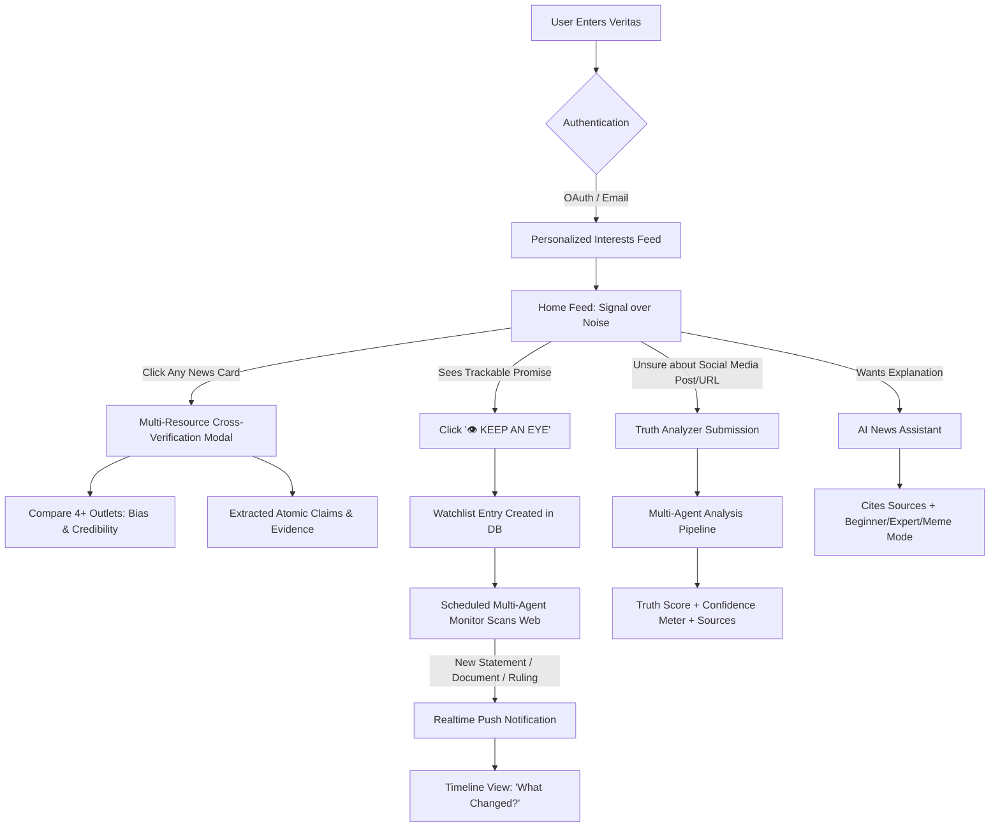
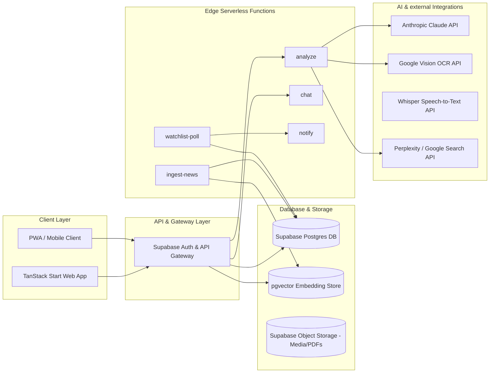
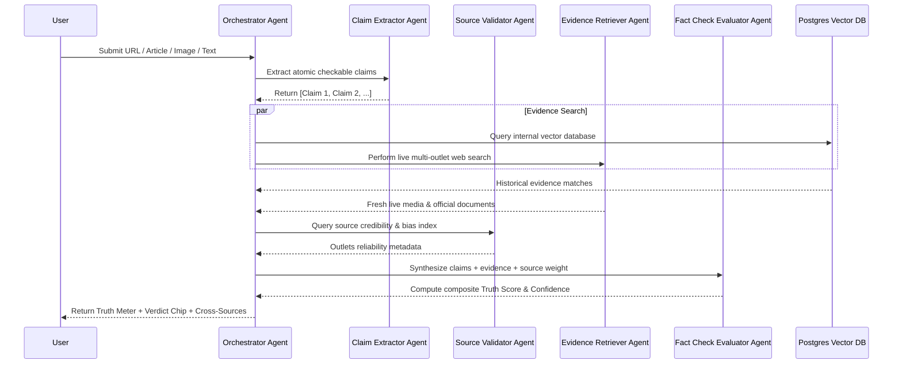
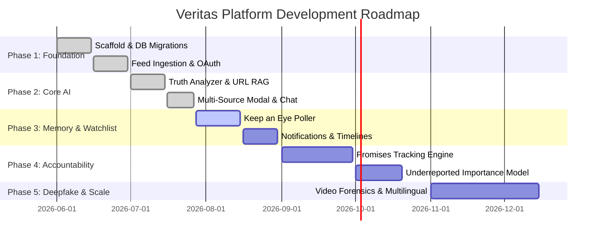

# VERITAS — REVOLUTIONARY AI-POWERED TRUTH PLATFORM
## Master System Architecture & Software Blueprint

> **Mission**: Build an AI-powered Truth Platform whose core objective is to serve human society by making people deeply informed, critically engaged, and empowered — replacing dopamine-driven engagement loops with radical transparency, evidence-graded verification, continuous accountability, and cross-source objective clarity.

---

## 1. Product Vision & Ethical Core

Traditional news media aggregators optimize for **clicks, outrage, and time-in-app**. They monetize human emotion and polarization.

**Veritas optimizes for TRUTH.**

Instead of asking *"What's happening today?"*, Veritas answers *"What is actually true?"*

```
┌────────────────────────────────────────────────────────────────────────┐
│                        VERITAS TRUTH PRINCIPLES                        │
├────────────────────────────────────────────────────────────────────────┤
│ 1. Evidence Before Verdict: Scores must be backed by transparent proof │
│ 2. Confidence Bands: Never claim absolute certainty; quantify confidence│
│ 3. Continuous Memory: Track claims & promises over months & years       │
│ 4. Importance Over Popularity: Elevate critical underreported issues   │
│ 5. Multi-Source Neutrality: Surface cross-spectrum coverage comparison │
└────────────────────────────────────────────────────────────────────────┘
```

### Core Value Metrics
- **North Star Metric**: *Resolved Understanding Events (RUE)* — The count of user-tracked claims, promises, and events that receive evidence-backed resolution.
- **Accountability Index**: Percentage of public commitments (political, corporate, environmental) actively tracked and updated against empirical outcomes.
- **Cognitive Clarity Score**: Reduction in user exposure to debunked viral misinformation without algorithmic shadow-banning.

---

## 2. Complete Feature Architecture

| Feature | Primary Function | User Impact | Tech Domain |
|---|---|---|---|
| **1. Multi-Tab News Feed** | Surface verified, breaking, trending, and live news | Replaces engagement algorithms with truth-weighted feeds | TanStack Start, Supabase Realtime |
| **2. Keep an Eye 👁** | Continuous tracking of promises, investigations, and roadmaps | Converts static news consumption into dynamic accountability | `pg_cron`, Multi-Agent Poller |
| **3. Needs Attention** | Surfacing critical underreported global & local crises | Counters popularity-driven algorithmic neglect | Cross-source coverage density scoring |
| **4. Misinformation Center** | Exposing viral fake news, deepfakes, and manipulated media | Provides forensic debunking with virality tracking | Multi-Agent Fact Checker, OCR, Vision AI |
| **5. Truth Analyzer (AI)** | Arbitrary input analysis (Text, URL, Image, PDF, Voice, Video) | Instant evidence-based verification for any claim | Claude RAG + Multi-Tool Orchestrator |
| **6. AI News Assistant** | Interactive conversational analysis, historical background, legal summary | Explains complex topics in Beginner/Expert modes | Web-grounded Streaming AI Chat |
| **7. Accountability Engine** | Public promise tracking & progress bars (Politicians, CEOs, NGOs) | Holds powerful entities accountable to empirical results | Automated document & statement parsing |
| **8. Multi-Source Comparison** | Every news card expands to show 4+ major outlets & bias leans | Eliminates bubble bias by displaying cross-spectrum reporting | Cross-outlet alignment clustering |
| **9. Meme-Based AI Personality** | Optional witty, engaging debunking tone ("Touch some sources 💀") | Keeps truth engaging for younger demographics without losing accuracy | Persona-swappable system prompt |

---

## 3. User Journey & End-to-End Workflow



---

## 4. UI / UX Design Specifications

### Design System Tokens
- **Theme**: Dark Editorial First (`oklch(0.16 0.012 250)` dark obsidian base).
- **Typography**: 
  - Display / Headlines: `Instrument Serif` (Classic, authoritative editorial feel)
  - Interface / Body: `Inter` (Hyper-readable modern sans-serif)
  - Numbers / Scores / Micro-data: `JetBrains Mono`
- **Semantic Verdict Colors**:
  - `True / Corroborated`: Emerald Green (`oklch(0.75 0.16 152)`)
  - `Mixed / Context Needed`: Warm Amber (`oklch(0.80 0.15 78)`)
  - `False / Debunked`: Crimson Red (`oklch(0.68 0.22 25)`)
  - `Unverified / Investigating`: Steel Gray (`oklch(0.65 0.02 250)`)
- **Visual Effects**:
  - Glassmorphic backdrop blur filters (`backdrop-blur-md`, `bg-card/80`)
  - Subtle noise grain overlay (`.grain::after`)
  - Interactive hover state glow & smooth micro-animations (`duration-200`)

---

## 5. Backend Infrastructure & Cloud Architecture



---

## 6. Multi-Agent AI Architecture

The heart of Veritas is a coordinated **Multi-Agent System (MAS)** where specialized sub-agents interact to extract, evaluate, score, and track news claims:



---

## 7. Database Schema (Postgres + pgvector DDL)

```sql
-- Extensions
create extension if not exists "uuid-ossp";
create extension if not exists "vector";

-- Sources Table
create table public.sources (
  id uuid primary key default gen_random_uuid(),
  name text not null,
  domain text unique,
  credibility_score numeric check (credibility_score between 0 and 100),
  bias_lean text check (bias_lean in ('Left','Center-Left','Center','Center-Right','Right','Independent')),
  region text,
  verified boolean default false,
  created_at timestamptz default now()
);

-- Articles Table
create table public.articles (
  id uuid primary key default gen_random_uuid(),
  title text not null,
  body text,
  url text unique,
  source_id uuid references public.sources(id) on delete set null,
  category text,
  published_at timestamptz default now(),
  image_url text,
  embedding vector(1536),
  created_at timestamptz default now()
);

-- Claims Table
create table public.claims (
  id uuid primary key default gen_random_uuid(),
  article_id uuid references public.articles(id) on delete cascade,
  submitted_by uuid references auth.users(id) on delete set null,
  text text not null,
  created_at timestamptz default now()
);

-- Evidence Table
create table public.evidence (
  id uuid primary key default gen_random_uuid(),
  claim_id uuid references public.claims(id) on delete cascade,
  source_id uuid references public.sources(id) on delete set null,
  snippet text not null,
  stance text check (stance in ('support','contradict','context')),
  url text,
  retrieved_at timestamptz default now()
);

-- Fact Checks Table
create table public.fact_checks (
  id uuid primary key default gen_random_uuid(),
  claim_id uuid references public.claims(id) on delete cascade,
  truth_score numeric check (truth_score between 0 and 100),
  confidence text check (confidence in ('low','medium','high')),
  verdict text check (verdict in ('true','mixed','false','unverified')),
  explanation text not null,
  methodology_version text default 'v1.0',
  created_at timestamptz default now()
);

-- Keep an Eye Watchlists
create table public.watchlists (
  id uuid primary key default gen_random_uuid(),
  user_id uuid references auth.users(id) on delete cascade not null,
  subject_type text check (subject_type in ('person','promise','event','topic')),
  subject_ref text not null,
  status text default 'active',
  created_at timestamptz default now()
);

-- Timeline Events
create table public.timeline_events (
  id uuid primary key default gen_random_uuid(),
  watchlist_id uuid references public.watchlists(id) on delete cascade,
  event_date timestamptz not null,
  summary text not null,
  source_url text,
  change_type text check (change_type in ('progress','delay','cancel','new_info')),
  created_at timestamptz default now()
);

-- Promises (Accountability Engine)
create table public.promises (
  id uuid primary key default gen_random_uuid(),
  entity_name text not null,
  entity_type text check (entity_type in ('politician','company','ngo','govt')),
  statement text not null,
  made_on date,
  category text,
  status text default 'pending',
  completion_pct numeric check (completion_pct between 0 and 100),
  created_at timestamptz default now()
);

-- User Profiles
create table public.profiles (
  id uuid primary key references auth.users(id) on delete cascade,
  display_name text,
  interests text[] default '{}',
  meme_mode boolean default false,
  created_at timestamptz default now()
);

-- Row Level Security (RLS)
alter table public.watchlists enable row level security;
create policy "Users manage own watchlists" on public.watchlists for all using (auth.uid() = user_id);

alter table public.profiles enable row level security;
create policy "Users edit own profile" on public.profiles for all using (auth.uid() = id);
```

---

## 8. Complete API Specifications

### Edge Function Endpoints
1. `POST /functions/v1/analyze`
   - **Payload**: `{ "input": "text, URL, image_url, or document_url" }`
   - **Returns**: Truth score, verdict, explanation, supporting & contradicting evidence list, confidence rating.
2. `POST /functions/v1/chat`
   - **Payload**: `{ "messages": [...], "memeMode": boolean, "difficulty": "beginner" | "expert" }`
   - **Returns**: Streaming citable responses grounded in live evidence.
3. `POST /functions/v1/watchlist-poll`
   - **Payload**: Invoked via `pg_cron` schedule.
   - **Returns**: Number of updated watchlists and generated timeline events.
4. `POST /functions/v1/ingest-news`
   - **Payload**: `{ "sources": ["bbc", "reuters", "ap"] }`
   - **Returns**: Count of new articles ingested and vectorized into `articles`.

---

## 9. Modern Directory & Folder Structure

```
veritas/
├── docs/
│   ├── system_architecture_and_implementation_plan.md
│   └── API_SPECIFICATIONS.md
├── src/
│   ├── routes/
│   │   ├── __root.tsx
│   │   ├── index.tsx                # Home Feed & Multi-Source Modal Trigger
│   │   ├── truth-analyzer.tsx       # Claim & Submission Analyzer
│   │   ├── keep-an-eye/             # Watchlist & Timeline Routes
│   │   │   ├── index.tsx
│   │   │   └── $watchlistId.tsx
│   │   ├── assistant.tsx            # AI Chat Assistant
│   │   └── settings.tsx             # User & Meme Mode Settings
│   ├── components/
│   │   ├── layout/                  # Sidebar, Header, Mobile Nav
│   │   ├── feed/
│   │   │   ├── FeedCard.tsx
│   │   │   ├── ArticleDetailModal.tsx # Multi-Source Cross-Verification Drawer
│   │   │   ├── TruthMeter.tsx
│   │   │   ├── VerdictChip.tsx
│   │   │   └── KeepAnEyeButton.tsx
│   ├── lib/
│   │   ├── database.types.ts
│   │   ├── supabase.ts
│   │   ├── useSession.ts
│   │   └── queries/
│   └── styles.css
├── supabase/
│   ├── migrations/
│   └── functions/
│       ├── analyze/
│       ├── chat/
│       ├── ingest-news/
│       └── watchlist-poll/
└── package.json
```

---

## 10. Complete Tech Stack Matrix

| Category | Recommended Technology |
|---|---|
| **Frontend Framework** | TanStack Start (React 19 + SSR + Vite) |
| **Styling & UI Components** | Vanilla CSS + Tailwind v4 + Radix Primitives + OKLCH Tokens |
| **State & Data Fetching** | TanStack Query v5 |
| **Database & Auth** | Supabase Postgres + Auth + RLS |
| **Vector DB** | `pgvector` extension in Postgres |
| **AI LLM Engine** | Anthropic Claude 3.5 Sonnet / Claude 3 Opus |
| **OCR & Vision** | Google Cloud Vision API |
| **Speech-to-Text** | OpenAI Whisper API |
| **Scheduled Workflows** | `pg_cron` + Supabase Edge Functions |

---

## 11. Multi-Phase Development Roadmap



---

## 12. Team Roles & Skill Requirements

1. **Lead Software Architect / AI Engineer (1)**: Multi-Agent orchestration, RAG pipelines, database schemas.
2. **Senior Frontend Engineer (1-2)**: TanStack Start, React 19, accessible Tailwind v4 styling, animations.
3. **Backend & Database Engineer (1)**: Postgres performance, pgvector indexing, Supabase Edge Functions, security RLS.
4. **UX/UI Product Designer (1)**: High-fidelity dark editorial design systems, timeline visualization.
5. **Human Fact-Checking Editor Panel (2-3)**: Verification audit oversight for high-stakes political or public health claims.

---

## 13. Comprehensive Cost Estimation & Scalability Model

| Scale Tier | Supabase Infra | LLM API Spend (Claude/Perplexity) | Total Monthly Cost |
|---|---|---|---|
| **100 Active Users** | Free / $25 Pro | $30 - $50 | **~$65 / mo** |
| **10,000 Active Users** | $110 / mo | $350 - $600 | **~$600 / mo** |
| **100,000 Active Users** | $600 / mo (Team Tier) | $2,500 - $4,500 | **~$4,000 / mo** |
| **1,000,000 Active Users** | Enterprise Cluster ($3k) | $20,000 - $35,000 | **~$30,000 / mo** |

*Cost Mitigation Note*: Fact-check outcomes are stored immutably in Postgres. Identical or similar claims queried by multiple users hit vector cache instant lookup, eliminating 90%+ of redundant LLM API calls.

---

## 14. Competitive Analysis Matrix

| Feature / Dimension | VERITAS 👁 | Google News | Inshorts | Ground News | Community Notes (X) | Perplexity |
|---|---|---|---|---|---|---|
| **Fact-Check Scoring** | **Deep, Evidence-Graded** | None | None | Bias Only | Crowd-sourced | Basic Synthesis |
| **Keep an Eye 👁 Tracking** | **Yes (Continuous Memory)** | No | No | No | No | No |
| **Accountability Engine** | **Yes (Promise Tracking)** | No | No | No | No | No |
| **Underreported Prioritization** | **Yes (Importance-Based)** | Click-based | Virality-based | No | Virality-based | Query-driven |
| **Multi-Source Cross-Verification** | **Yes (Every Card Clickable)** | Basic Links | Single Summary | Yes (Paid) | No | Text Citations |
| **Ad-Free Truth Optimization** | **Yes** | Ad-driven | Ad-driven | Subscription | Subscription | Subscription |

---

## 15. Risk Assessment & Mitigations

```
┌──────────────────────────────┬────────────────────────────────────────────────────────┐
│ Risk Factor                  │ Engineering & Product Mitigation Strategy              │
├──────────────────────────────┼────────────────────────────────────────────────────────┤
│ 1. AI Hallucinations         │ Grounding RAG in mandatory web search & official links;│
│                              │ explicit confidence scoring; human editor override.    │
│ 2. Perceived Political Bias  │ Fully transparent scoring methodology; multi-spectrum  │
│                              │ source panel balancing Left/Center/Right outlets.      │
│ 3. Legal & Defamation Risks  │ Frame outputs as evidence synthesis & source audit     │
│                              │ rather than unappealable subjective libel claims.      │
│ 4. Prompt Injection Attacks  │ Sanitize input text; separate user prompt context from │
│                              │ system evaluation instructions in Edge Functions.      │
└──────────────────────────────┴────────────────────────────────────────────────────────┘
```

---

## 16. How Veritas Improves Society over Dopamine Algorithms

1. **Replaces Forgotten Promises with Persistent Memory**: Citizens no longer forget what leaders pledged 6 months ago because the system alerts them to progress or failure.
2. **Mitigates Outrage Bias**: Surfacing multi-outlet comparisons dismantles echo chambers and forces users to see how different media organizations frame the exact same event.
3. **Elevates Neglected Crises**: The *Needs Attention* tab actively rescues critical environmental, local corruption, and public health stories from algorithmic erasure.
4. **Empowers Critical Thinking**: By showing confidence bands and contradicting evidence, Veritas turns passive readers into active, evidence-driven critical thinkers.

---
*Documentation maintained by Veritas Product & Engineering Architecture Team.*
